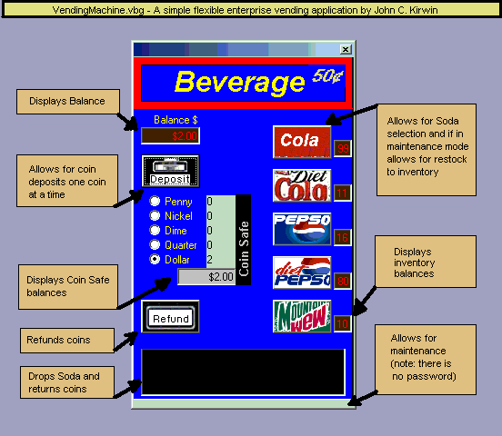



## Vending Machine

### Description

A simple flexible enterprise vending application that I created as a project for my VB6 Distributed Applications Class.
 
### More Info
 
The VendingMachine.zip unzips to the C:\VendingMachine directory. The VendingMachine.sql script needs to be executed to add objects to the pubs database on Microsoft SQL Server.

             |
---                |---
**Submitted On**   |2001-11-27 21:16:32
**By**             |[John C Kirwin](https://github.com/Planet-Source-Code/PSCIndex/blob/master/ByAuthor/john-c-kirwin.md)
**Level**          |Intermediate
**User Rating**    |4.0 (20 globes from 5 users)
**Compatibility**  |VB 5\.0, VB 6\.0
**Category**       |[Complete Applications](https://github.com/Planet-Source-Code/PSCIndex/blob/master/ByCategory/complete-applications__1-27.md)
**World**          |[Visual Basic](https://github.com/Planet-Source-Code/PSCIndex/blob/master/ByWorld/visual-basic.md)
**Archive File**   |[Vending\_Ma3802311282001\.zip](https://github.com/Planet-Source-Code/john-c-kirwin-vending-machine__1-29277/archive/master.zip)

